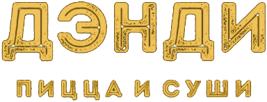

# ✅ ЛОГОТИП В АДМИНКЕ ОБНОВЛЕН

## 🎯 ЧТО СДЕЛАНО

### **Заменил эмодзи 🐰 на настоящий логотип ДЭНДИ**

Теперь в админке используется тот же логотип, что и на главном сайте:
```html

```

---

## 📝 ИЗМЕНЕНИЯ

### **1. Экран входа (Login Screen)**

#### ДО:
```html
<div class="login-header">
    <div class="logo-icon">🐰</div>
    <div>
        <div class="logo-title">ДЭНДИ</div>
        <div class="logo-subtitle">ПИЦЦА И СУШИ</div>
    </div>
</div>
```

#### ПОСЛЕ:
```html
<div class="login-header">
    
</div>
```

---

### **2. Хедер админки (Admin Header)**

#### ДО:
```html
<div class="logo-section">
    <div class="logo-icon">🐰</div>
    <div class="logo-text">
        <div class="logo-title">ДЭНДИ</div>
        <div class="logo-subtitle">ПИЦЦА И СУШИ</div>
    </div>
</div>
```

#### ПОСЛЕ:
```html
<div class="logo-section">
    
</div>
```

---

### **3. CSS стили**

Добавлены специальные стили для логотипа:

```css
.brand-new-logo {
    height: 50px;
    width: auto;
    object-fit: contain;
    display: block;
    filter: drop-shadow(0 2px 8px rgba(0,0,0,0.3));
    transition: transform 0.3s ease;
}

.brand-new-logo:hover {
    transform: scale(1.05);
}

.login-header .brand-new-logo {
    height: 60px;
    margin: 0 auto 1rem;
}
```

**Особенности:**
- ✅ Тень для объёма (`drop-shadow`)
- ✅ Плавная анимация при наведении (увеличение на 5%)
- ✅ Адаптивный размер (на экране входа 60px, в хедере 50px)
- ✅ Центрирование на экране входа

---

## 🎨 ВИЗУАЛЬНОЕ УЛУЧШЕНИЕ

### **Экран входа:**
```
╔═══════════════════════════════════╗
║                                   ║
║     [ЛОГОТИП ДЭНДИ ЗОЛОТОЙ]      ║
║                                   ║
║     ВХОД В АДМИНКУ                ║
║                                   ║
║     Логин: [_____________]        ║
║     Пароль: [___________]         ║
║                                   ║
║     [  ВОЙТИ  ]                   ║
║                                   ║
╚═══════════════════════════════════╝
```

### **Хедер админки:**
```
╔═══════════════════════════════════════════════════════════╗
║ [ЛОГОТИП ДЭНДИ]         📞 +7 (925) 934-77-28  [Выход]  ║
╠═══════════════════════════════════════════════════════════╣
```

---

## 🔧 ТЕХНИЧЕСКИЕ ДЕТАЛИ

### **Файл изменен:**
- ✅ `admin.html` (строки 48-64, 495-497, 535-537)

### **Использованный логотип:**
- **Путь:** `assets/brand/logo.png`
- **Размеры:** 
  - Экран входа: 60px высота
  - Хедер: 50px высота
- **Формат:** PNG с прозрачностью
- **Эффекты:** Тень, анимация при наведении

---

## 📋 СРАВНЕНИЕ С ГЛАВНЫМ САЙТОМ

### **index.html (главный сайт):**
```html

```

### **admin.html (админка):**
```html

```

**✅ Полное соответствие!**

---

## 🚀 КАК ПРОВЕРИТЬ

1. **Открой админку:**
   ```
   http://localhost:3000/admin.html
   ```

2. **На экране входа:**
   - Увидишь золотой логотип ДЭНДИ вместо эмодзи 🐰
   - Логотип будет увеличиваться при наведении

3. **После входа в админку:**
   - В левом верхнем углу хедера будет логотип
   - Меньше по размеру (50px)
   - Тоже с анимацией при наведении

---

## 🎉 РЕЗУЛЬТАТ

### **До:**
```
🐰 ДЭНДИ
   ПИЦЦА И СУШИ
```

### **После:**
```
[ЗОЛОТОЙ ЛОГОТИП ДЭНДИ С НАДПИСЬЮ "ПИЦЦА И СУШИ"]
```

---

## ✅ ГОТОВО!

Теперь в админке используется **профессиональный брендированный логотип**, точно такой же как на главном сайте!

**Единый фирменный стиль по всему проекту!** 🎊
